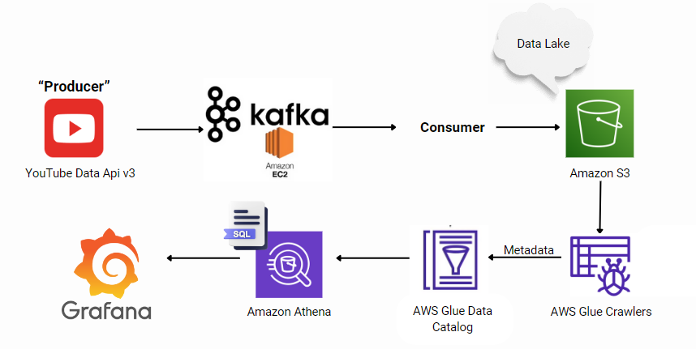
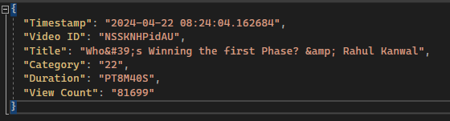
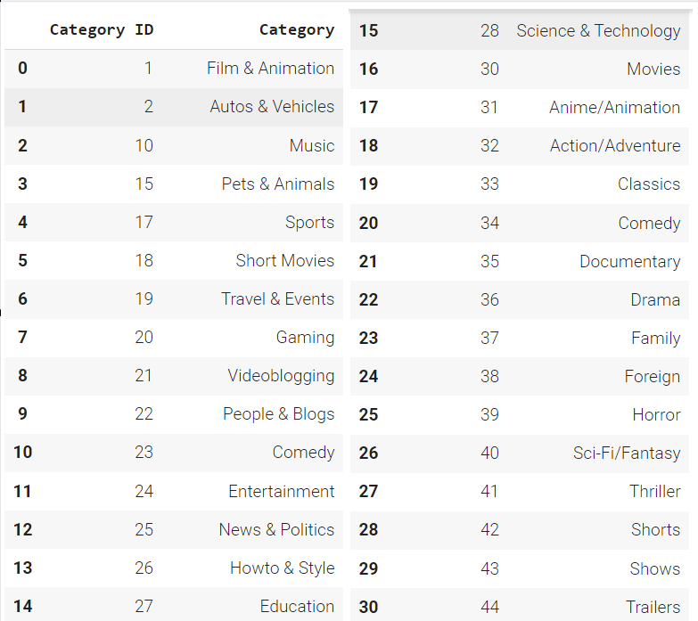
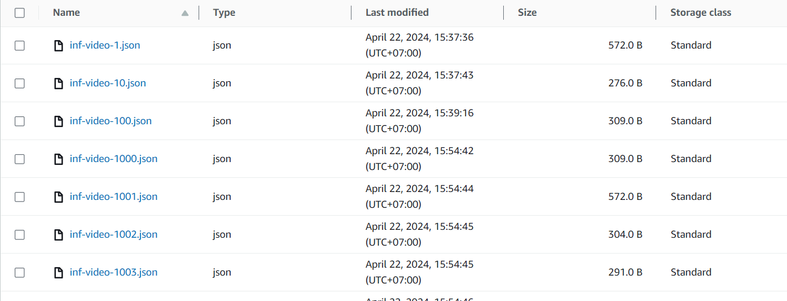
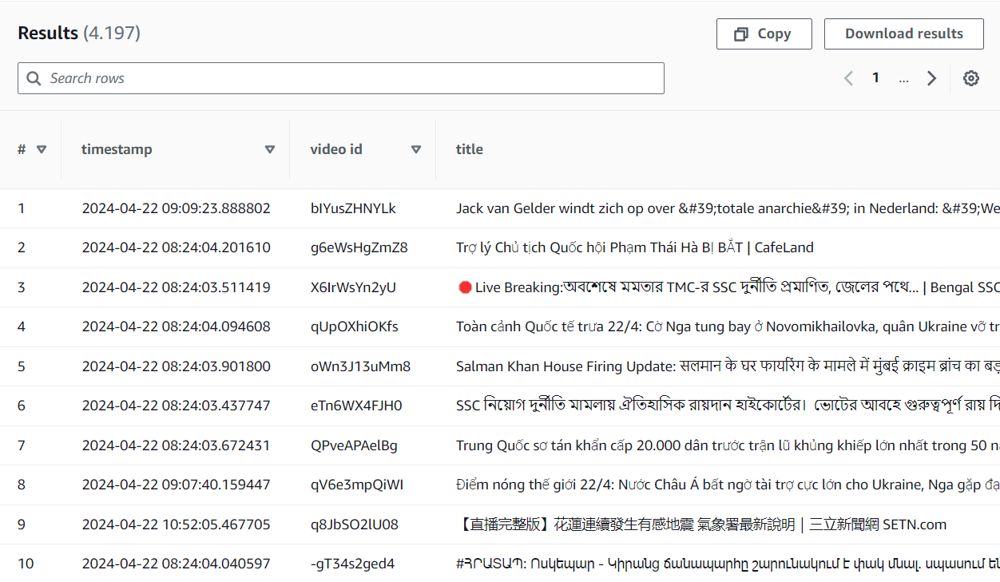
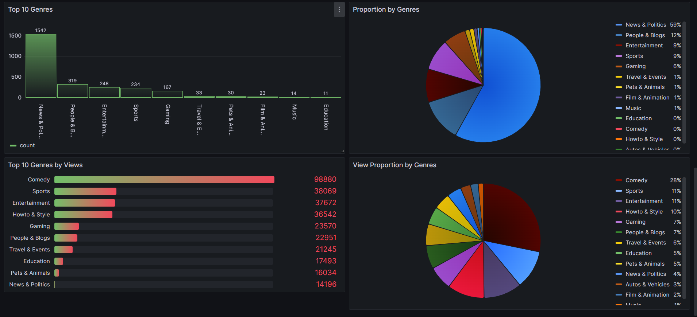
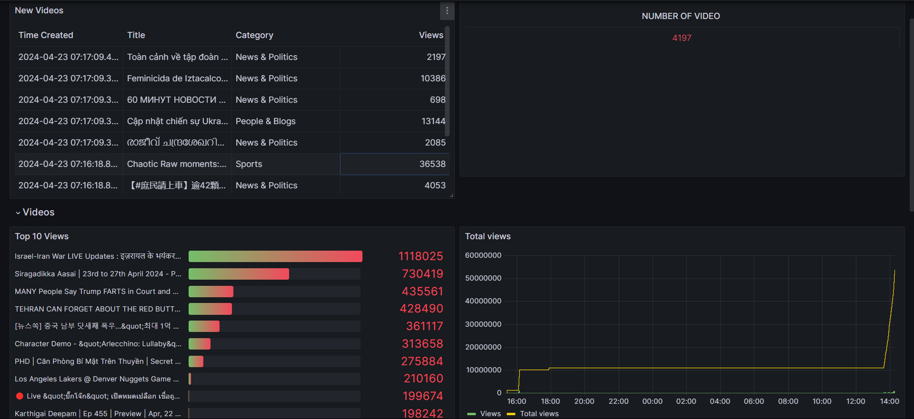

# Analyst-Youtube-UsingKafka

## Data
We used API from Google Cloud with the limit 10000 requests/day through Free-base Account. 
For account limitations, to smoothly demonstrate and clearly display streaming data in real time, I retrieve information from the latest 50 videos in the Vietnam region. The producer upload speed to the server is 1 video/second.

A sample file data in Json:

The API returns a lot of information for each video, but we only extract the following details:

- Video ID
- Title
- Category: Represented by numerical values. Please refer to the image below to understand which category each numerical value corresponds to.
- Duration: The duration of the video is represented in the ISO 8601 standard.
- View Count: The number of views at the time the API is called.

Additionally, We include an additional piece of information for easy sorting of videos by "Timestamp".

I do not know why its ID breaks at 2 and some other places, but since this is the Google Cloud API, why is it like that, I have no idea!!! :<

## Store Data, Extract Schema and Query
### Store Data

We use Amazon S3 to store data. It is a Data Lake capable of accepting any type of input data. Below is a small portion of the stored data.

### Extract Schema

We use AWS Glue Crawler to crawl from data files into metadata and send it to the Glue Data Catalog for storage.

### Query
Based on the data stored in Amazon S3, along with the metadata stored in the Amazon Glue Data Catalog, we utilize Amazon Athena to query the data for visualization purposes.
Below is a sample query using Athena.

## Visualization

In simple terms, Grafana utilizes the query results based on Athena to visualize data through a dashboard. With auto-reload settings, it is a suitable tool for visualizing real-time data. Below is an image of my dashboard.

***Finally, here is a small project from our team serving the assignment of the course "Big Data Analytics and Business Intelligence." I am very pleased that through this project, I have gained more knowledge about AWS and Kafka. :D <3 luv***
